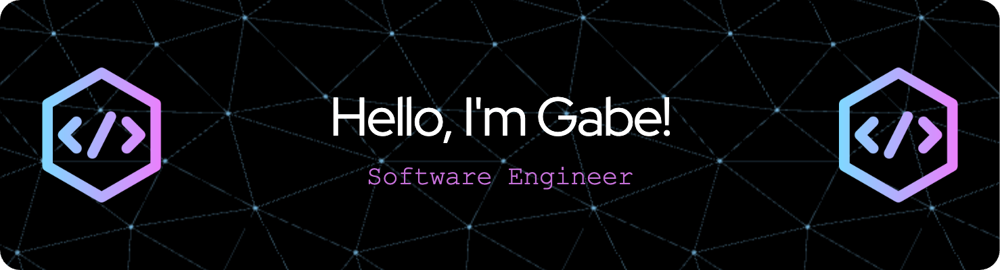

<div align="center">

![ruby-badge][ruby] ![rails-badge][ruby-rails] ![python-badge][python] ![fastapi-badge][fastapi] ![flask-badge][flask] ![HTML5-badge][HTML5] ![CSS3-badge][CSS3] ![javascript-badge][javascript] ![react-badge][react] ![postgresql-badge][postgresql] ![mongodb-badge][mongodb] ![circleci-badge][circleci] ![github-actions-badge][github-actions] ![postman-badge][postman] ![docker-badge][docker]<br>
    
</div>

###  A little more about me...

```json
{
    "data": {
        "type": "creator of code",
        "id": 87,
        "attributes": {
            "name": "Gabe Nunez",
            "pronouns": [ "he", "him" ],
            "currently_learning": [ "Java", "Angular", "TypeScript", "Express", "AWS" ],
            "location": "Arizona",
            "background": "Software engineer possessing extensive mortgage and financial services experience",
            "hobbies": [ "singing", "birding", "cooking", "traveling", "college sports" ],
            "education": {
                "turing_school_of_software_and_design": "Certificate of Backend Engineering"
            }
        },
        "links": {
            "self": "https://github.com/gabrielcnunez",
            "linkedin": "https://www.linkedin.com/in/gabriel-nunez-az/"
        }
    }
}
``` 

### Please reach out and say hello! 

[![LinkedIn: gabriel-nunez-az][linkedin-badge]][LinkedIn]
[![gmail-badge]][Gmail]
<br>

<a href="https://github.com/anuraghazra/github-readme-stats" target="_blank"><!-- wi*quL3fcV --></a>

<!-- LINKS -->

[gmail-badge]: https://img.shields.io/badge/-gabriel.c.nunez@gmail.com-c14438?style=flat&logo=Gmail&logoColor=white
[Gmail]: mailto:gabriel.c.nunez@gmail.com

[linkedin-badge]: https://img.shields.io/badge/Gabriel%20Nunez-%23OpenToWork-green?style=flat&logo=Linkedin&logoColor=black&color=7DE787&labelColor=A5D6FF
[LinkedIn]: https://www.linkedin.com/in/gabriel-nunez-az/

[ruby]: https://img.shields.io/badge/-Ruby-CC0000?style=flat-square&logo=ruby&logoColor=FEFEFE
[ruby-rails]: https://img.shields.io/badge/-Ruby_on_Rails-CC0000?style=flat-square&logo=ruby-on-rails&logoColor=FEFEFE

[python]: https://img.shields.io/badge/-Python-FFD43B?style=flat-square&logo=python&logoColor=blue
[fastapi]: https://img.shields.io/badge/FastAPI-005571?style=flat-square&logo=fastapi
[flask]: https://img.shields.io/badge/Flask-%23000.svg?style=flat-square&logo=flask&logoColor=white

[HTML5]: https://img.shields.io/badge/-HTML5-E34F26?style=flat-square&logo=html5&logoColor=FEFEFE
[CSS3]: https://img.shields.io/badge/-CSS3-1572B6?style=flat-square&logo=css3&logoColor=FEFEFE
[javascript]: https://img.shields.io/badge/-JavaScript-black?style=flat-square&logo=javascript
[react]: https://img.shields.io/badge/-ReactJS-61DAFB?logo=react&logoColor=white&style=flat-square

[postgresql]: https://img.shields.io/badge/PostgreSQL-316192?style=flat-square&logo=postgresql&logoColor=white
[mongodb]: https://img.shields.io/badge/MongoDB-%234ea94b.svg?style=flat-square&logo=mongodb&logoColor=white

[circleci]: https://img.shields.io/badge/CircleCI-343434?style=flat-square&logo=circleci&logoColor=white
[github-actions]: https://img.shields.io/badge/GitHub%20Actions-%232671E5.svg?style=flat-square&logo=githubactions&logoColor=white
[postman]: https://img.shields.io/badge/Postman-FF6C37?style=flat-square&logo=postman&logoColor=white
[docker]: https://img.shields.io/badge/Docker-%230db7ed.svg?style=flat-square&logo=docker&logoColor=white
